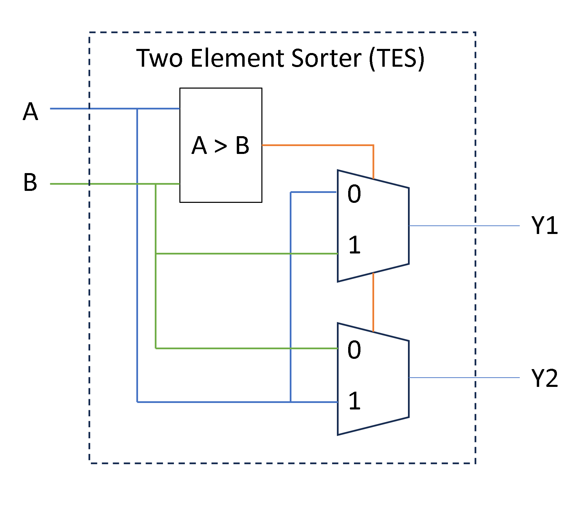
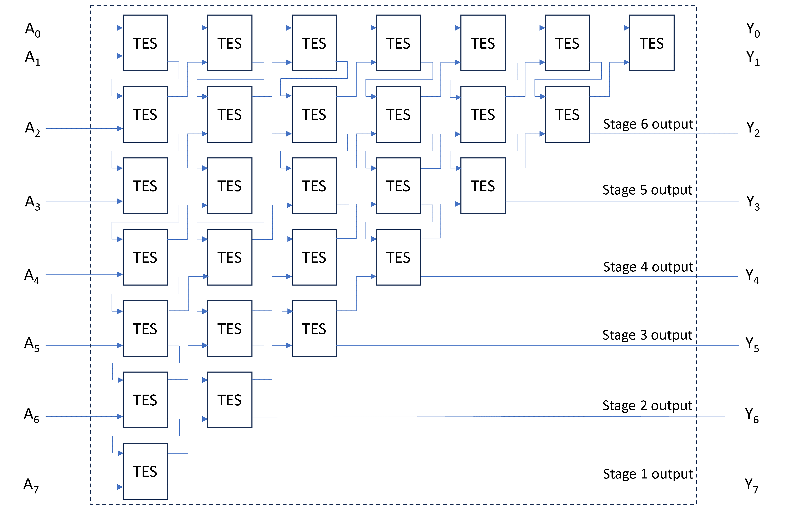

# Problem 1
## Problem Statement
Identify a transactor that helps in verifying a DUT that sorts 8 bit values on A,B,C,D,E,F,G and H in ascending order. Implement the test environment that handles all the possible cases.

## Solution

### RTL for 8 Input sorter
This is the hardware implementation of bubble-sort containing seven stages of bubbling the highest value. The basic element in this design is a Two Element Sorter (TES) which sorts two 8-bit elements.

Using the above TES blocks in 7 stages, we can sort 8 8-bit inputs as described below.

